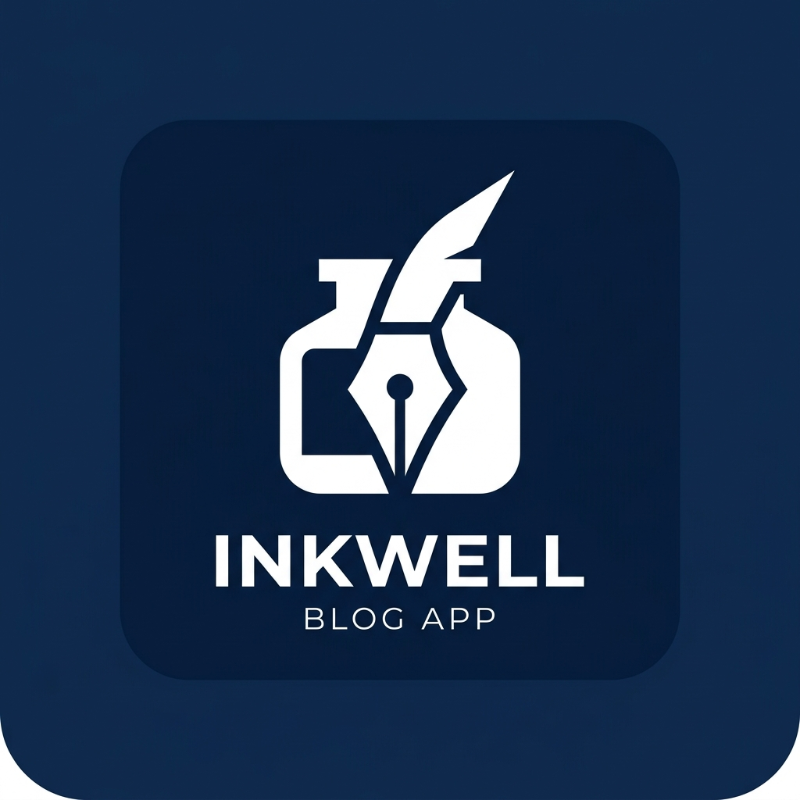

# Inkwell 🖋️

**A calmer reading desk for your daily feed.**

Inkwell is a beautiful, cross-platform publishing and reading platform built with **Flutter** and **Supabase**. Designed with a premium aesthetic, it allows writers to publish seamlessly and readers to discover content in a distraction-free environment.



## 🌐 Live Demo
Check out the live web application here: [**Inkwell Web App**](https://zaintahir2025.github.io/blog_app/)

## ✨ Key Features
- **Cross-Platform**: Runs natively on Web, Android, iOS, Windows, and macOS from a single codebase.
- **Premium UI/UX**: Crafted with a stunning Deep Royal Blue and Gold color palette, featuring glassmorphism and subtle micro-animations.
- **Responsive Layout**: Adapts perfectly from mobile screens to ultra-wide desktop monitors, featuring an expanding sidebar.
- **Real-time Database**: Powered by Supabase for instantaneous syncing of stories, bookmarks, and user profiles.
- **Social Hub**: Follow friends, send messages, and discover what others are reading.
- **Smart Feed**: Automatically categorizes content into Latest, Trending, and Picked for You.

## 🛠️ Tech Stack
- **Frontend**: Flutter (Dart)
- **State Management**: Riverpod
- **Routing**: GoRouter
- **Local Storage**: Hive
- **Backend & Auth**: Supabase
- **Hosting**: GitHub Pages

## 🚀 Getting Started

### Prerequisites
- [Flutter SDK](https://docs.flutter.dev/get-started/install) (latest stable version)
- A [Supabase](https://supabase.com/) account and project.

### Installation

1. **Clone the repository**
   ```bash
   git clone https://github.com/zaintahir2025/blog_app.git
   cd blog_app
   ```

2. **Install dependencies**
   ```bash
   flutter pub get
   ```

3. **Configure Supabase**
   - Open `lib/main.dart`
   - Update the `Supabase.initialize` block with your project URL and Anon Key.

4. **Run the App**
   ```bash
   flutter run
   ```

## 📜 License
This project is licensed under the MIT License.
